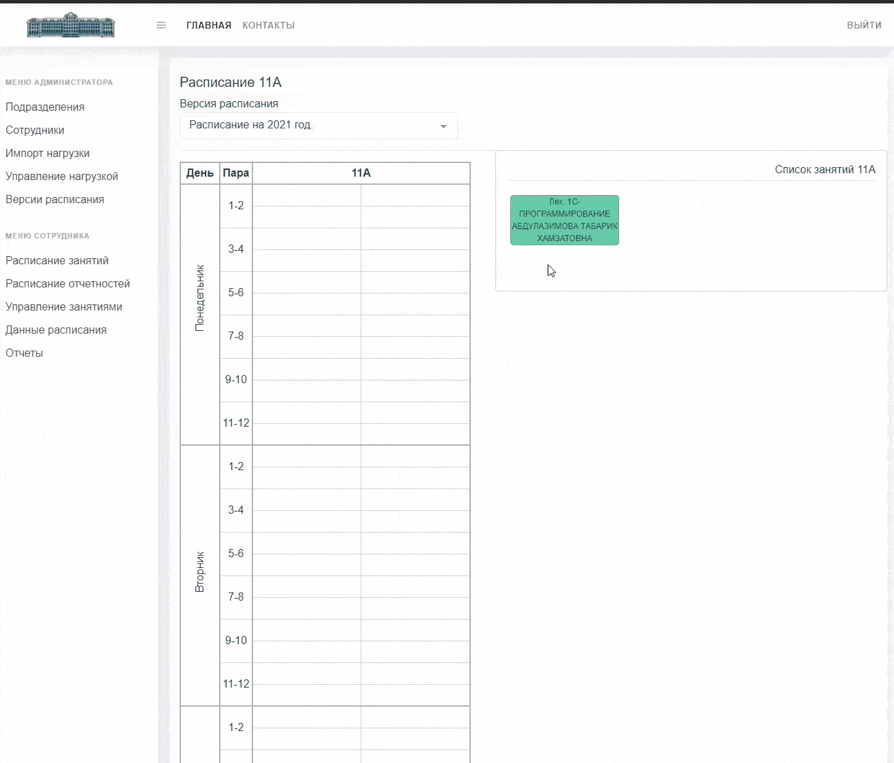
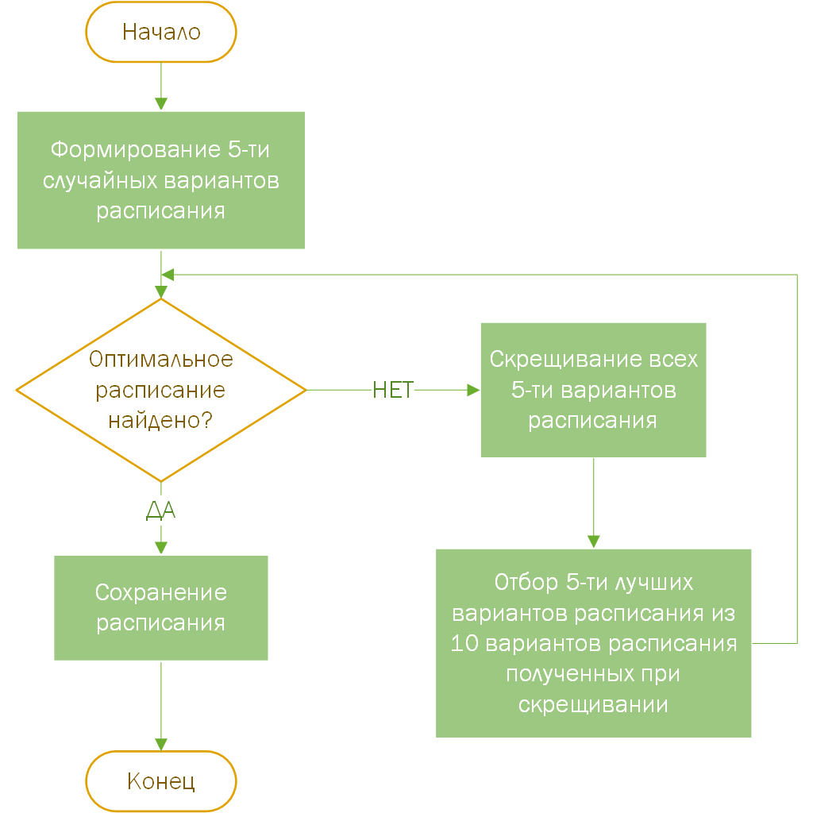

## Общее описание решения

Проект является цифровым решением в рамках конкурса World AI&DATA Challenge, соответствующим задаче "Создание сервиса автоматического расписания для школы" (https://datamasters.ru/task?id=183)

## Общее описание логики работы решения

Система позволяет формировать расписания как в ручном так и автоматическом режиме.

Ручное формирование основано на Drag&Drop, перетаскивая занятия на сетку расписания они сохранют указанную позицию. Так формируется расписания для каждого класса.

Автоматическое формирование основано на генетических алгоритмах. 
1. При запуске автоматического формирования, система создает 5 разных расписаний со случайным расположением занятий на сетке расписания.
2. Далее каждое расписание проходит проверку соотвествия всем требованиям, если сформировано оптимальное расписание все данные сохраняются и проверка завершается
3. Если оптимальное расписание не обнаружено, то происходит скрещивание всех 5-ти вариантов расписания и из них формируется 10 новых вариантов из которых в свою очередь выберается 5 лучших.
4. Процесс снова начинается с пункта 2 этого списка.

## Требования к окружению для запуска продукта

Backend: кроссплатформенное решение реализованное на .Net Core 3.1, для развертывания можно использовать традиционный IIS, либо кросс-платформенный веб-сервер Kestrel. Я использую IIS Express из VS Community. 

Frontend: реализовано на vuejs 3. Необходим Node.js.

DB: используется MS Sql Server 2016 Developer. Можно использовать Postgres Sql, но тестирование с этой СУБД еще не проводилось, лучше придерживаться MS Sql Server.

## Сценарий сборки и запуска проекта

Backend:

Solution состоит из 5 проектов.
1. BL (Бизнес логика. Здесь собраны сервисы, в которых и реализована вся бизнес-логика).
2. CoreAPI (Главный проект backenda. Здесь реализованы контроллеры, через которые и осуществляется взаимодействие с frontend. Данный проект является запускаемым(стартовым, запуск этого проекта запускает backend). Если по какой-либо причине это не так, нужно через контекстное меню проекта выбрать его запускаемым).
3. DAL (Здесь собраны модели БД, контект и миграции).
4. DTL (Здесь реализована логика копирования(Mapping) сущностей БД в объекты для передачи на frontend и обратно).
5. Infrastructure (Здесь собраны логика для учета прогресса формирования расписания и прочее).

Запуск backenda

1. Запустить проект CoreAPI в Visual Studio.
2. При первом запуске проект сам создаст БД с необходимыми данными для работы. Строка подключения к серверу БД лежит тут(CoreAPI/appsettings.json).
3. После сборки и запуска проекта (если проект настроен на запуск браузера), то откроеся браузер с `кодом 404`. Это нормально.
4. Все. Backend поднят и работает. Пора приступать с frontend.

Frontend:

1. Установить Node.js (https://nodejs.org/en/blog/release/v14.17.3/)
2. Запустить `npm intstall` из папки WebUI для установки Vuejs и всех компонентов.
3. После установки собрать проект и запустить `npm run serve`
4. После сборки и запуска перейту по адресу `http://localhost:8080/`

Все готово. Теперь система работает по адресу `http://localhost:8080/`. Приятного использования.

Данные авторизации:
`login: admin`
`password: Admin`

## Примеры использования

Для удобства система уже работает по адресу (http://college-chesu.chesutime.ru/#/login). Данные для входа в панель администратора, соответствуют указанным выше паролю и логину.

## Используемые наборы данных
Данные для импорта, по которым можно формировать расписание лежат в тут же. Файл [Timetable-Data.xlsx](Timetable-Data.xlsx).

## General Solution Description

The project is a digital solution within the framework of the World AI & DATA Challenge competition, corresponding to the task "Creating an automatic timetable service for a school" (https://datamasters.ru/task?id=183)

## Solution's logics general description

The system allows you to create schedules both in manual and automatic modes.

Manual formation is based on Drag & Drop, by dragging activities onto the schedule grid, they will save the specified position. This is how the timetable for each class is formed.

Automatic generation is based on genetic algorithms.
1. When starting automatic formation, the system creates 5 different schedules with a random arrangement of classes on the schedule grid.
2. Further, each schedule is checked for compliance with all the requirements, if an optimal schedule is formed, all data is saved and the check is completed
3. If the optimal schedule is not found, then all 5 variants of the schedule are crossed and 10 new variants are formed from which, in turn, the 5 best are selected.
4. The process starts again from point 2 of this list.

## Environment requirements for product launch

Backend: a cross-platform solution implemented on .Net Core 3.1, you can use traditional IIS for deployment, or the Kestrel cross-platform web server. I am using IIS Express from VS Community.

Frontend: implemented in vuejs 3. Node.js required.

DB: Used by MS Sql Server 2016 Developer. Postgres Sql can be used, but testing with this DBMS has not been done yet, it is better to stick to MS Sql Server.

## Compilation and launch scenario

Backend:

Solution consists of 5 projects.
1. BL (Business logic. Services are collected here, in which all business logic is implemented).
2. CoreAPI (The main backenda project. Controllers are implemented here through which interaction with the frontend is carried out. This project is launchable (starting, launching this project launches the backend). If for some reason this is not so, you need to select its runnable).
3. DAL (Database models, context and migrations are collected here).
4. DTL (The logic of copying (Mapping) database entities into objects for transferring to the frontend and vice versa is implemented here).
5. Infrastructure (Logic is collected here to take into account the progress of the formation of the schedule, etc.).

Backenda launch

1. Run the CoreAPI project in Visual Studio.
2. At the first start, the project itself will create a database with the necessary data for work. The connection string to the database server is located here (CoreAPI / appsettings.json).
3. After building and running the project (if the project is configured to launch the browser), then a browser will open with a `code 404`. This is fine.
4. Everything. The backend is up and running. It's time to start with the frontend.

Frontend:

1. Install Node.js (https://nodejs.org/en/blog/release/v14.17.3/)
2. Run `npm intstall` from the WebUI folder to install Vuejs and all components.
3. After installation, build the project and run `npm run serve`
4. After assembly and launch, go to the address `http: // localhost: 8080 /`

All is ready. The system is now running at `http: // localhost: 8080 /`. Enjoy your use.

Authorization data:
`login: admin`
`password: Admin`

## Use cases and examples

For convenience, the system is already working at (http://college-chesu.chesutime.ru/#/login). The credentials for entering the admin panel correspond to the above password and login.

## Used datasets 

The data for import, according to which you can create a schedule, are right there. The file [Timetable-Data.xlsx](Timetable-Data.xlsx).

